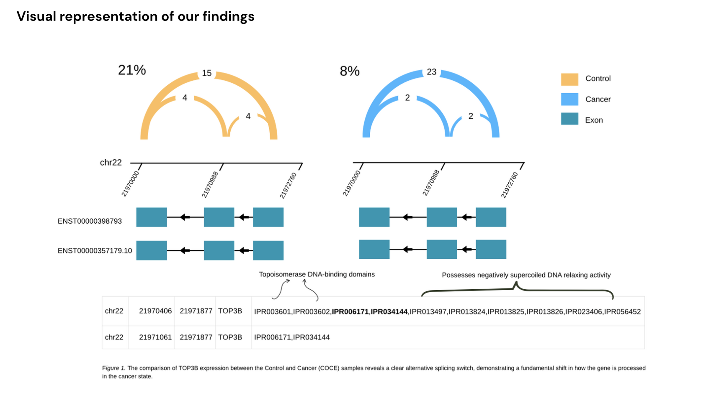
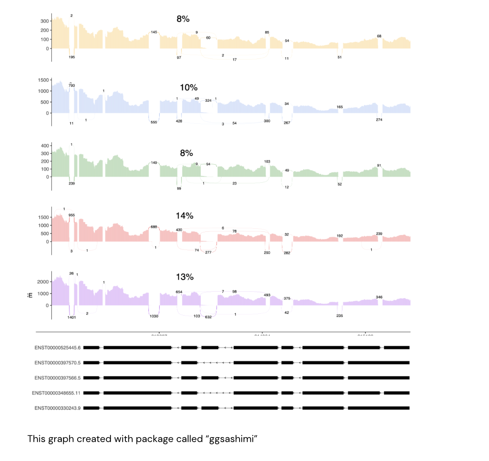

# Erasmus-project
 I completed my Erasmus+ research internship at Leipzig University under the supervision of Dr. Stephan Bernhart, where I worked on “Advanced high-throughput RNA sequencing data analysis".

I developed a computational workflow for detecting splicing events in isoform regions in leukemia datasets.
As a conclusion, we see the large highly significant switch in isoform usage across conditions. 

## Screenshots

