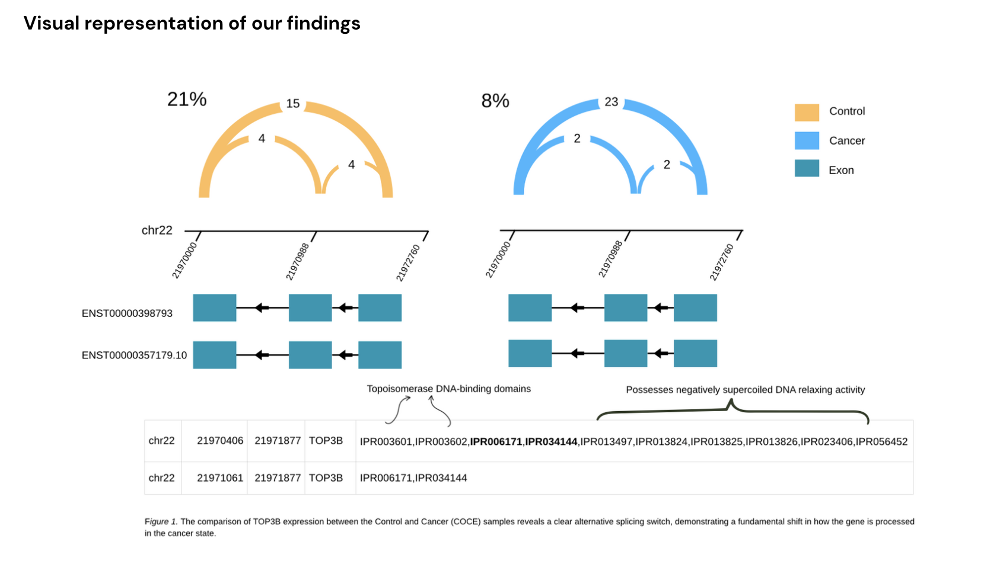
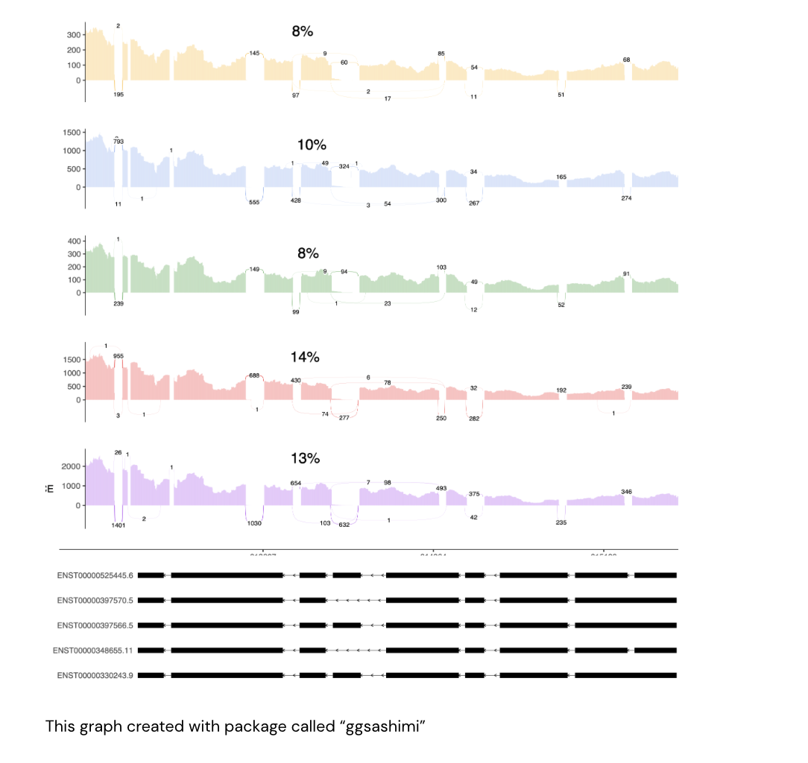

# Erasmus-project
 I completed my Erasmus+ research internship at Leipzig University under the supervision of Dr. Stephan Bernhart, where I worked on “Advanced high-throughput RNA sequencing data analysis.

## Screenshots

